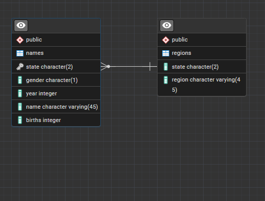

# Maven-Baby-Name-Trend-Analysis
A guided project provided by Maven Analytics. View trends in baby name popularity based on US social security data from 1980-2010.

## There are two tables: names and region:
### The Region Table
| Column Name      | Data Type     | Description                                                                                   |
|------------------|---------------|-----------------------------------------------------------------------------------------------|
| state            | CHAR[2]       | US 2-digit State Code                                                                         |
| region           | VARCHAR[45]   | US Geographic Regions - Not Abbreviated                                                       |

### The Names Table
| Column Name      | Data Type     | Description                                                                                   |
|------------------|---------------|-----------------------------------------------------------------------------------------------|
| state            | CHAR[2]       | US 2-digit State Code                                                                         |
| gender           | CHAR[1]       | The gender of the baby ('M' or 'F')                                                           |
| year             | INTEGER       | The year in which the baby was born                                                           |
| name             | VARCHAR[45]   | The name of the baby                                                                          |
| births           | INTEGER       | The number of babies born with this name in this year                                         |

### ERD

---

Screenshots of the output are in the Images folder, organized by objective. The scripts containing the queries that Maven Analytics provided for populating the database are in the Data folder. The analysis scripts are in the SQL folder, also organized by objective.
